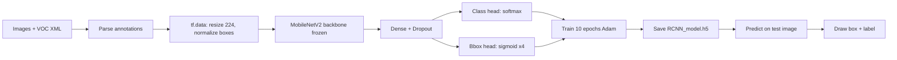

# R-CNN for Cat & Dog Object Detection (TensorFlow + MobileNetV2)

[](https://www.python.org/)
[](https://www.tensorflow.org/)
[](https://www.kaggle.com/)
End-to-end **object detection** pipeline that classifies **cats vs dogs** and predicts **bounding boxes** in images. Built with **TensorFlow/Keras**, **transfer learning** on **MobileNetV2**, and **Pascal VOC–style XML annotations** from the [Dog and Cat Detection](https://www.kaggle.com/datasets/andrewmvd/dog-and-cat-detection) dataset on Kaggle.

> **What you get:** a trainable dual-head CNN (classification + box regression), a reproducible Jupyter workflow, saved model export (`.h5`), and matplotlib-based inference visualizations.

---

## Table of Contents

- [Overview](#overview)
- [Features](#features)
- [How It Works](#how-it-works)
- [Project Structure](#project-structure)
- [Dataset](#dataset)
- [Requirements](#requirements)
- [Quick Start (Kaggle)](#quick-start-kaggle)
- [Run Locally](#run-locally)
- [Training](#training)
- [Inference](#inference)
- [Model Architecture](#model-architecture)
- [Results & Visualization](#results--visualization)
- [Keywords & Use Cases](#keywords--use-cases)
- [Contributing](#contributing)
- [Author](#author)
- [License](#license)

---

## Overview

This repository implements **CNN-based object detection** for a two-class problem: **cat** and **dog**. Images are resized to **224×224**, normalized, and fed into a **frozen MobileNetV2** backbone. Two dense heads predict:

1. **Class probabilities** (cat / dog) — softmax, 2 units  
2. **Bounding box coordinates** — sigmoid, 4 units (`xmin`, `ymin`, `xmax`, `ymax`, normalized to image size)

The workflow originated as a **Kaggle GPU notebook** (`cats_dogs_detection_RCNN.ipynb`) and is suitable for learning **R-CNN-style detection** concepts, **transfer learning**, and **TensorFlow `tf.data`** pipelines without a full two-stage R-CNN stack (Selective Search, per-region SVM, etc.).

**Ideal for:** students, ML engineers prototyping pet detectors, and anyone searching for *TensorFlow object detection*, *cat dog bounding box*, or *MobileNetV2 detection* examples.

---

## Features

| Feature | Description |
|--------|-------------|
| **Transfer learning** | ImageNet-pretrained **MobileNetV2** backbone |
| **Dual outputs** | Simultaneous **classification** and **bbox regression** |
| **VOC XML parsing** | Loads annotations from standard **Pascal VOC** `.xml` files |
| **`tf.data` pipeline** | Batched preprocessing with normalized boxes |
| **Training plots** | Accuracy and loss curves via Matplotlib |
| **Model export** | Saves `RCNN_model.h5` for reuse |
| **Inference helpers** | `predict_image()` + `draw_bbox()` for visual results |
| **Architecture diagram** | Optional **visualkeras** layered view |

---

## How It Works



1. **Data** — Walk annotation folder, parse XML into a pandas DataFrame (`filename`, `width`, `height`, `class`, `xmin`–`ymax`).  
2. **Preprocess** — Decode JPEG, resize to 224×224, scale pixels to `[0, 1]`, normalize box coords by image dimensions, one-hot encode class.  
3. **Train** — `model.fit()` on batched dataset (default **batch size 32**, **10 epochs**).  
4. **Infer** — Load `.h5`, run `model.predict()`, scale bbox back to original resolution, overlay with Matplotlib.

---

## Project Structure

```
RCNN-for-object-detection/
├── cats_dogs_detection_RCNN.ipynb   # Main notebook: train + test pipeline
├── README.md                        # This file
└── public/                          # (Optional assets; not required for training)
```

The notebook is the **single source of truth** for training and evaluation code.

---

## Dataset

| Item | Detail |
|------|--------|
| **Name** | Dog and Cat Detection |
| **Source** | [Kaggle — andrewmvd/dog-and-cat-detection](https://www.kaggle.com/datasets/andrewmvd/dog-and-cat-detection) |
| **Layout** | `images/` (`.png`) and `annotations/` (`.xml`) |
| **Classes** | `cat` → `0`, `dog` → `1` |
| **Format** | Pascal VOC XML (`filename`, `size`, `object/name`, `bndbox`) |

On Kaggle, paths resolve to:

- `/kaggle/input/dog-and-cat-detection/images`
- `/kaggle/input/dog-and-cat-detection/annotations`

---

## Requirements

```text
python>=3.7
tensorflow>=2.x
pandas
numpy
opencv-python
Pillow
matplotlib
visualkeras   # optional, for model diagram
```

Install locally:

```bash
pip install tensorflow pandas numpy opencv-python Pillow matplotlib visualkeras
```

**Hardware:** CPU works for small experiments; **GPU** (Kaggle or local CUDA) speeds up training noticeably.

---

## Quick Start (Kaggle)

1. Fork or clone this repo, or upload `cats_dogs_detection_RCNN.ipynb` to [Kaggle Notebooks](https://www.kaggle.com/code).
2. **Add dataset:** [Dog and Cat Detection](https://www.kaggle.com/datasets/andrewmvd/dog-and-cat-detection) → *Add to notebook*.
3. Enable **GPU** accelerator (Settings → Accelerator → GPU).
4. **Run All** — training writes to `/kaggle/working/RCNN_Model/RCNN_model.h5`.
5. Use the **Test Model** section with any image under the dataset `images/` folder.

Example test path used in the notebook:

```python
image_path = '/kaggle/input/dog-and-cat-detection/images/Cats_Test1401.png'
predict_image(image_path, model)
```

---

## Run Locally

1. **Clone the repository**

   ```bash
   git clone https://github.com/danishjavedcodes/RCNN-for-object-detection.git
   cd RCNN-for-object-detection
   ```

2. **Download the dataset** from Kaggle (CLI or manual unzip) into a folder, e.g. `data/dog-and-cat-detection/`.

3. **Update paths** in the notebook (replace Kaggle paths):

   ```python
   images_path = Path('data/dog-and-cat-detection/images')
   anno_path = Path('data/dog-and-cat-detection/annotations')
   model_path = './RCNN_Model/RCNN_model.h5'
   ```

4. Open and run the notebook:

   ```bash
   jupyter notebook cats_dogs_detection_RCNN.ipynb
   ```

---

## Training

Core training configuration from the notebook:

| Hyperparameter | Value |
|----------------|-------|
| Input size | 224 × 224 × 3 |
| Backbone | MobileNetV2 (`imagenet`, `include_top=False`) |
| Backbone trainable | `False` (frozen) |
| Dense hidden | 128, ReLU |
| Dropout | 0.5 |
| Optimizer | Adam |
| Class loss | `categorical_crossentropy` |
| Bbox loss | `mean_squared_error` |
| Batch size | 32 |
| Epochs | 10 |

```python
history = model.fit(dataset, epochs=10)
model.save('./RCNN_Model/RCNN_model.h5')
```

After training, inspect `history` for `class_output_accuracy` and `loss` plots.

---

## Inference

Load the saved model and run prediction on a single image:

```python
import tensorflow as tf

model = tf.keras.models.load_model('./RCNN_Model/RCNN_model.h5')
predict_image('path/to/your/image.png', model)
```

`predict_image()`:

- Resizes input to 224×224 for the network  
- Takes **argmax** of class probabilities for cat vs dog  
- Denormalizes bbox to **original image width/height**  
- Calls `draw_bbox()` to render the rectangle and confidence label  

---

## Model Architecture

```
Input (224, 224, 3)
    └── MobileNetV2 (frozen, ImageNet weights)
            └── Flatten
                    └── Dense(128, relu) → Dropout(0.5)
                            ├── class_output: Dense(2, softmax)   # cat / dog
                            └── bbox_output:  Dense(4, sigmoid)    # normalized box
```

**Note:** This is a **single-stage, dual-head detector** built on a CNN backbone—not the original multi-stage **R-CNN** (region proposals + per-ROI classifiers). The name reflects the **detection task** (class + localized box) commonly associated with R-CNN family methods; for production you may later explore **Faster R-CNN**, **SSD**, or **YOLO**.

Optional architecture visualization:

```python
import visualkeras
visualkeras.layered_view(model, legend=True, to_file='model.png')
```

---

## Results & Visualization

- **Training:** Matplotlib curves for accuracy and loss per epoch.  
- **Testing:** Red bounding box overlay with label `Cat` or `Dog` and confidence score.  
- **Export:** `model.png` from visualkeras (if that cell is run).

Metrics depend on dataset split and epochs; re-run on Kaggle GPU for comparable timings to the original notebook.

---

## Keywords & Use Cases

**Search terms this project covers:**

`R-CNN`, `object detection`, `cat dog detector`, `bounding box regression`, `TensorFlow Keras`, `MobileNetV2 transfer learning`, `Pascal VOC XML`, `computer vision`, `deep learning`, `Kaggle notebook`, `image classification and localization`, `pet detection`

**Use cases:**

- Educational demos for **CNN object detection**  
- Baseline **cat/dog** detector before moving to YOLO or Detectron2  
- Template for **custom two-class** detectors with your own VOC-style labels  

---

## Contributing

Contributions are welcome.

1. Fork the repository  
2. Create a feature branch (`git checkout -b feature/improve-detector`)  
3. Commit changes with clear messages  
4. Open a Pull Request  

Ideas: validation split, mAP evaluation, data augmentation, unfreezing top MobileNet blocks, or exporting to **TFLite** / **ONNX**.

---

## Author

**Danish Javed** — [@danishjavedcodes](https://github.com/danishjavedcodes)

- Repository: [RCNN-for-object-detection](https://github.com/danishjavedcodes/RCNN-for-object-detection)  
- Original notebook: Kaggle *cats_dogs_detection_RCNN* (May 2024)

If this project helped you, consider starring the repo on GitHub.

---

## License

No license file is included yet. Add a `LICENSE` (for example, MIT) before publishing or reusing this code in other projects.

---

## Acknowledgments

- Dataset: [Dog and Cat Detection on Kaggle](https://www.kaggle.com/datasets/andrewmvd/dog-and-cat-detection)  
- Backbone: [MobileNetV2](https://keras.io/api/applications/mobilenet/) (Keras Applications)  
- Framework: [TensorFlow](https://www.tensorflow.org/)
